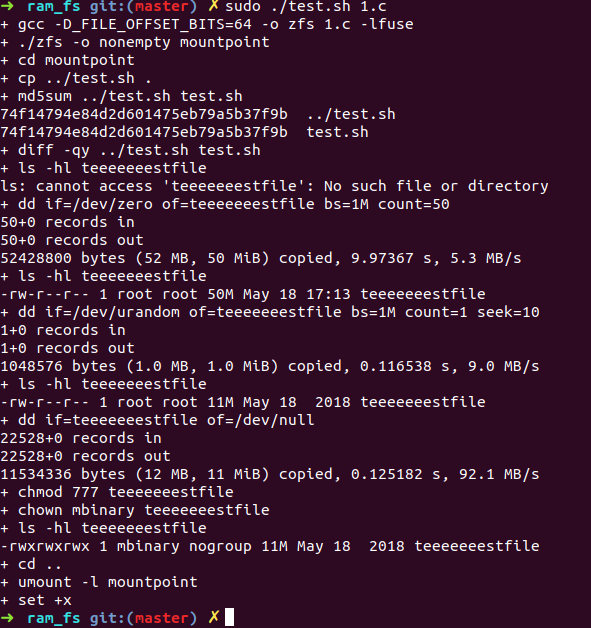

# Simple Filesystem
> An implementation of userspace filesystem using fuse interfaces

## Function
- [x] read file
- [x] write file
- [x] truncate file
- [x] ls: view attrs 
- [x] chown, chmod, mv: change attrs
- [ ] directory operations ( to do )
## Design
### metadata of fs
* TOTAL SIZE: 4G
* BLOCKSIZE: 4KB
* BLOCKNR  : 4G/4KB
* NAME_LENGTH: 256
* block_no_t: int  (the type of block_no)
* Each block has a block_no at the begining 
### super block
block 0( aka mem[0]) is the super block.

It stores the num of used_blocks and the num of the latest used block.

The latedt used block is exactly the head block of the node-chain, so we can use this to visit all entry nodes.
### filenode 
metadata of each entry( dir or file) stored in mem blocks 
including : 
* int block_no  : num of mem block
* int content   : is the value of the first mem block_no of the files's content( for dir, it's -1)
* stat st       : st of each entry
* filenode\* next: next node
* char name[256]: entry name 

### Free space allocation algorithm 
`next fit`

## Resource
- [binary file](src/oshfs)
- [test file](src/test.sh)

## Vision

## Licence
[MIT](LICENCE)
